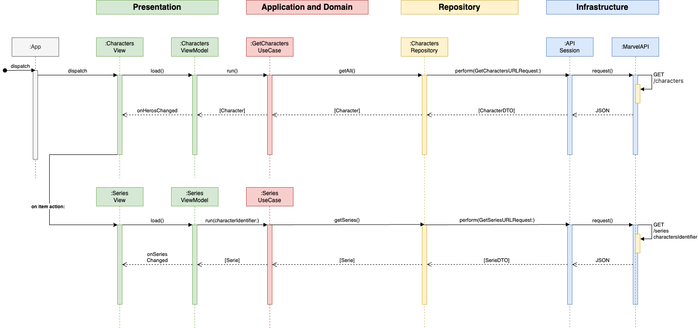
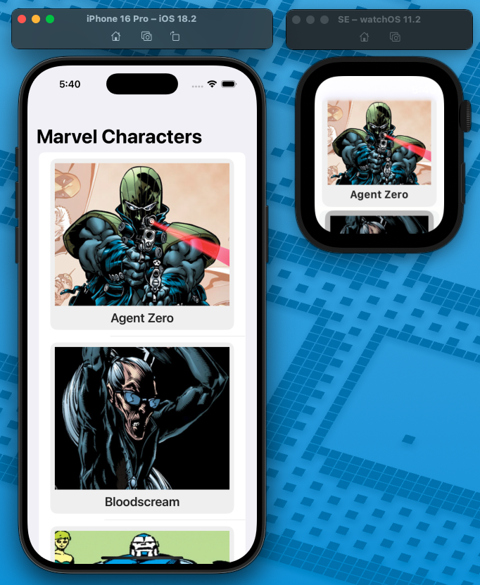
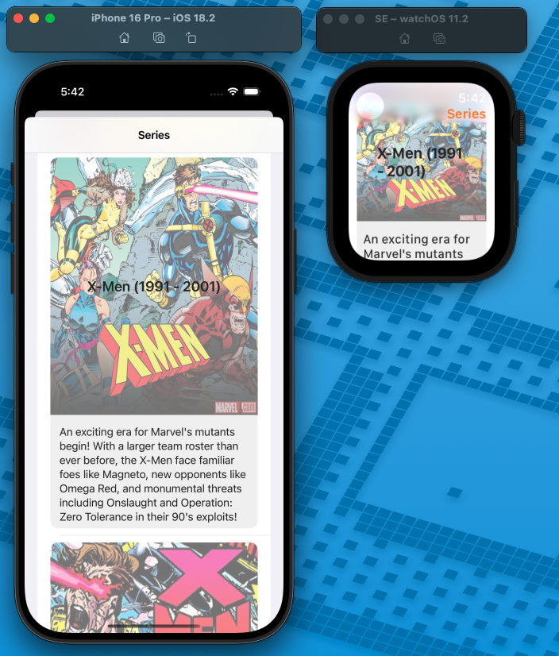

# Marvel Characters

## 📝 Requirements
* It is a multiplatform project and includes watchOS support
* Implements the Clean Architecture using the MVVM design pattern in the Presentation layer
* Uses Async/Await and Combine for network tasks
* UI built with SwiftUI
* Unit tests for services, use cases and view models
* Consumes the Marvel REST API

## 🐾 Features
* Character Lits
* Character Detail that displays series

## 🧽 Sequence Diagram

## Screenshots
| Characters | Series |
|--------|--------|
|   |  |

## 🍻Testing

This project has at least 50% of covergae

Some issues I found adding unit test in each feature:

* URL error since the "vi/public" should be placed in each endpoint, the path is versioning
* Decoding error since the paramas of root JSON and data are mandatory
* After this the request succeed, the Agent Zero is the first result